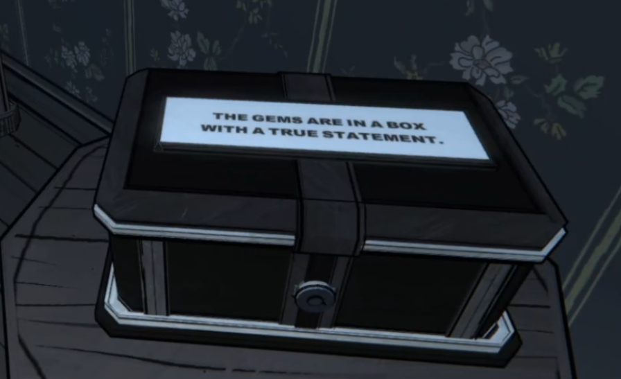

# Solving Boolean Logic Puzzles in Blue Prince

## Introduction

This guide aims to provide a crash course in propositional logic, predicates and quantifiers used to create and understand logical structures, like the box puzzle in the game Blue Prince.

### Terms

A **proposition** is any statement that can be only $\text{true}$ or $\text{false}$. For example, "the sky is blue".

A **predicate** is a conditional statement that is $\text{true}$ or $\text{false}$ based on the value of a **proposition**.

A **quantifier** is a conditional statement that is $\text{true}$ or $\text{false}$ based on the value of multiple **propositions**.

Lets declare some **propositions** for our boxes, using $b$ for boxes:

$b_{\text{blue}}$ represents the blue box 
$b_{\text{white}}$ represents the white box 
$b_{\text{black}}$ represents the black box 

Our **predicates** will use $C$ for contains:

$C(b_{\text{blue}})$ is TRUE if the blue box contains the gems 
$C(b_{\text{white}})$ is TRUE if the white box contains the gems 
$C(b_{\text{black}})$ is TRUE if the black box contains the gems 

## Global Rules

Lets declare the domain $D=\\{b_{\text{blue}},b_{\text{white}},b_{\text{black}}\\}$ which includes all the boxes as elements. $b$ can be any of the boxes.

This puzzle has a few global rules:

1. **There will always be at least one box which displays only true statements**.

This can be expressed with the **quantifier** $∃b∈D\ C(b)$.

This reads as "There exists a *box* in the domain $D$ where the proposition *the box contains gems* is TRUE." 

Put more simply, **at least one** proposition is true.

2. **There will always be at least one box which displays only false statements**.

This can be expressed with the **quantifier** $∃b∈D\ \neg C(b)$.

This reads as "There exists a *box* in the domain $D$ where the proposition *the box contains gems* is FALSE." 

3. **Only one box has a prize within. The other 2 are always empty.**

We can express this as the **compound proposition** $C(b_{\text{blue}} \oplus  b_{\text{white}} \oplus b_{\text{black}}$) where $\oplus$ represents **exclusive or**. 

---

We can wrap it all up in one nice expression: $(∃b∈D\ C(b)) \wedge (∃b∈D\ \neg C(b))$ which simply joins the first two rules together. Fortunately, we don't have to worry about the math here, lets just turn all of these constraints into a **rule** we will call **Global Condition**. 

## Statements

Lets call our statements $s$, and our **predicate** will be $P$ which will be TRUE if the box is labeled with a true statement.

1. The **blue** box states, **"Two of these statements are true."**

We can write this as: $$P(s_{\text{blue}})↔[(P(s_{\text{blue}})∧P(s_{\text{white}})∧¬P(s_{\text{black}}))∨(P(s_{\text{blue}})∧P(s_{\text{black}})∧¬P(s_{\text{white}}))∨(P(s_{\text{white}})∧P(s_{\text{black}})∧¬P(s_{\text{blue}}))]$$

But instead, lets just make another **rule** we will call **Two Trues**.

2. The **white** box states, **"The statement on the blue box is true."**

We can write this as: $P(s_{\text{white}})↔P(s_{\text{blue}})$.
This is read as, "The statement on the white box is true **if and only if** the statement on the blue box is true." 
Alternatively, the true or false values for $P(s)$ must be the same.

Lets make this another **rule** called **white** $\leftrightarrow$ **blue**.

3. The **black** box states, **"The gems are in a box with a true statement."**

This statement concerns the **gems**, as well as the statement, so we need a new **proposition**, $G(b)$ which is true if the box $b$ contains a gem.
This is written $P(s_{\text{black}})↔[(G(s_{\text{blue}})∧P(s_{\text{blue}}))∨(G(s_{\text{white}})∧P(s_{\text{white}}))∨(G(s_{\text{black}})∧P(s_{\text{black}}))]$

We don't need a rule here because this if this statement is true, the value of the above proposition will be reflected in the value of $P(s_\text{black})$ since it is equivalent to what is on the right of the proposition. **You may need to make a fourth rule if your statement requires it.**

## The Gems

That was rough, I know, but we're almost there! Now we need to create a truth table out of the values of $P(s)$. For each box, we give every combination possible of TRUE (T) or FALSE (F) values. Since we have 3 boxes, the number of combinations is $2^3$ or 8.

| $P(s_{\text{blue}})$ | $P(s_\text{white})$ | $P(s_\text{black})$ | Global Condition?     | Two Trues?      | white $\leftrightarrow$ blue? |
| -------------------- | ------------------- | ------------------- | --------------------- | --------------- | ----------------------------- |
| T                    | T                   | T                   | Fails- no false value | Pass            | Pass                          |
| T                    | T                   | F                   | Pass                  | Pass            | Pass                          |
| T                    | F                   | T                   | Pass                  | Pass            | Fail $F\ne T$                 |
| T                    | F                   | F                   | Pass                  | Fail - one true | Fail $T\ne F$                 |
| F                    | T                   | T                   | Pass                  | Pass            | Fail $F\ne T$                          |
| F                    | T                   | F                   | Pass                  | Fail- one true  | Fail $T\ne F$                 |
| F                    | F                   | T                   | Pass                  | Fail- one true  | Pass                          |
| F                    | F                   | F                   | Fails- no true value  | Fail- none true | Pass                          |

Now we simply find the row that passed all our **rules**:

| $P(s_{\text{blue}})$ | $P(s_\text{white})$ | $P(s_\text{black})$ | Global Condition? | Two Trues? | white $\leftrightarrow$ blue? |
| -------------------- | ------------------- | ------------------- | ----------------- | ---------- | ---------------------- |
| T                    | T                   | F                   | Pass              | Pass       | Pass                   |

We have our final configuration: The **blue** box has a **true** statement, the **white** box has a **true** statement, and the **black** box has a **false** statement. If you have more than one row that passes all the rules, try looking at your rules more closely.

Since the **false** statement on the **black** box is the odd one out, our gems are located within!

